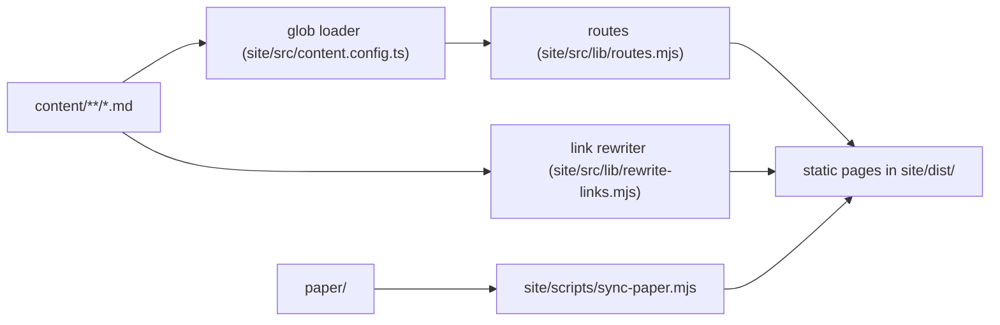

# Architecture

The parts of this repository and how they fit together. For anyone changing the structure or
the website.

## Parts

- `content/` holds the teachings as markdown. Five numbered parts (foundations, doctrine,
  practice, way of life, context) contain sections, which contain pages.
- `paper/` holds the founding paper as published. The first version of `content/` was split
  out of it.
- `site/` is an Astro project that renders `content/` into a static website.

## How content reaches the site

- The loader reads every markdown file under `content/`.
- `routes.mjs` turns a file path into a URL: numeric prefixes are dropped and a `README.md`
  becomes its folder's page, so `content/2-doctrine/README.md` is served at `/doctrine`.
- The markdown links between pages point at `.md` files so they work on GitHub. The link
  rewriter turns them into site routes at build time.

## Infrastructure

`infra/` defines the Cloudflare Pages project with OpenTofu: a direct-upload project with no
git source, so nothing is published except by the deploy workflow. State is kept in a Cloudflare
R2 bucket through the S3-compatible backend; the bucket, its endpoint and every credential are
GitHub secrets and never appear in a file. `.github/workflows/iac.yml` checks formatting and
validity on every change to `infra/`. Planning on pull requests and applying on `main` are off
until the repository variable `IAC_ENABLED` is set to `true`.

The custom domain, unifiedpathoflight.com, is in `infra/domain.tf`. Its nameservers point to
Cloudflare, so the zone sits in the same account as the Pages project. The file attaches the
apex and `www` to the project and adds a proxied CNAME for each; DNSSEC and the records for a
domain that sends no email are separate switches, both off by default. All of it is off until
the `SITE_DOMAIN` repository variable is set. The site itself never names its domain: the
origin still comes from `SITE`, which moves to the custom domain only once its certificate is
active.

`.github/workflows/deploy.yml` is the only path to production: on a push to `main` it runs the
site gate, uploads the built site with Wrangler, and smoke-tests the live site. Pull requests from
branches of this repository get a preview deployment. It skips the upload while the Cloudflare
secrets are absent.

## Gates

`scripts/check.sh` is the single gate entry point, used by CI and before every pull request. It
runs the site checks (markdown lint, build, link gate), the doctrine gate
(`scripts/check-doctrine.py`, which holds the teachings to the core beliefs and to a balance
between traditions, see [doctrine-guardrails.md](doctrine-guardrails.md)) and the vendored
toolkit gates in `.claude/toolkit/`. `CLAUDE.md` holds the locked decisions an agent or contributor must not
break.

## Rendering on phone and desktop

The text is one fluid column capped at a reading measure of 42rem; the header and footer share
a wider bar. There are two breakpoints, both in `site/src/styles/global.css`: on a phone the
five parts stay on one row that scrolls sideways inside the header, and from 36rem the pager
sits in two columns. It is held correct by a gate, not by inspection: `site/scripts/check-mobile.mjs` renders every page at
phone, tablet and desktop widths. Desktop widths run the same overflow check as phones, so a
mobile fix that breaks the desktop view fails too. Touch-target sizes are set in
`site/src/styles/global.css`.

## Presentation

All presentation lives in `site/src/styles/global.css` and `site/src/layouts/Base.astro`; the
teachings carry none. The stylesheet defines the colour tokens for the light and dark schemes
(text colours hold at least 4.5:1 contrast), the type scale, and print rules. Two typefaces are
self-hosted from pinned npm packages, because the Content-Security-Policy allows fonts from
this origin only: Cormorant Garamond for headings and Source Serif 4 for text.

Three things are drawn from structure rather than written into a teaching:

- A numbered list of links that follows a heading (every "Contents" and "In this section"
  list) is shown as a set of cards. The markdown stays a plain list.
- Every page ends with a pager to the previous and next page in reading order, worked out by
  `readingOrder` in `site/src/lib/nav.ts` from the same `order` front matter as the navigation.
- The home page opens with one photograph, `site/src/assets/hero-crepuscular-rays.jpg`, served
  in AVIF, WebP and JPEG at four widths by Astro's image pipeline at build time.

The header marks the part the reader is in with `aria-current`, and a skip link leads to the
text.

## Search and sharing

`site/src/layouts/Base.astro` gives every page a title, description, canonical URL, Open Graph
tags (`components/seo/Meta.astro`) and Schema.org JSON-LD for the site and its breadcrumb trail
(`components/seo/JsonLd.astro`, `lib/structured-data.ts`). The build also writes
`sitemap-index.xml` and `robots.txt`. All absolute URLs come from the `SITE` environment
variable.

For language models and answer engines the build also writes, from the same entries and the
same route function as the pages (`site/src/lib/machine-text.ts`):

- a markdown alternate of every page, at the page's address plus `index.md`, announced in the
  page head with `rel="alternate" type="text/markdown"`;
- `llms.txt`, a short orientation and a linked outline of every page;
- `llms-full.txt`, the whole text in reading order in one file.

`robots.txt` allows every crawler and names the main AI crawlers explicitly. Each content page
carries Article JSON-LD, and the home page describes the founding paper. No dates are emitted,
because the text carries none. The social image is drawn by `site/scripts/generate-og.mjs` and
committed as `site/public/og-default.png`.

## Decisions

- **Content sits outside the site.** The text must outlive any website technology and stay
  readable on GitHub. The cost is the small link rewriter.
- **Folder `README.md` files are the navigation.** GitHub renders them automatically, and the
  site reuses them as section pages, so there is one table of contents, not two.
- **Order lives in front matter; only the top-level parts carry numeric prefixes.** Pages can
  be reordered without renaming files or breaking URLs.
- **The link rewriter is a remark plugin**, so the site depends on `@astrojs/markdown-remark`
  in addition to Astro.
- **Static output only.** The site is built to plain files with no adapter and no server code,
  so it can be hosted on Cloudflare Pages' free plan or any other static host. URLs end in a
  trailing slash because that is how Pages serves folders; it avoids a redirect on every link.
