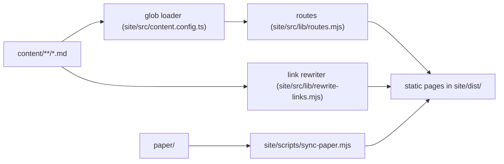

# Architecture

The parts of this repository and how they fit together. For anyone changing the structure or
the website.

## Parts

- `content/` holds the teachings as markdown. Five numbered parts (foundations, doctrine,
  practice, way of life, context) contain sections, which contain pages.
- `paper/` holds the founding paper as published. The first version of `content/` was split
  out of it.
- `site/` is an Astro project that renders `content/` into a static website.

## How content reaches the site

- The loader reads every markdown file under `content/`.
- `routes.mjs` turns a file path into a URL: numeric prefixes are dropped and a `README.md`
  becomes its folder's page, so `content/2-doctrine/README.md` is served at `/doctrine`.
- The markdown links between pages point at `.md` files so they work on GitHub. The link
  rewriter turns them into site routes at build time.

## Gates

`scripts/check.sh` is the single gate entry point, used by CI and before every pull request. It
runs the site checks (markdown lint, build, link gate) and the vendored toolkit gates in
`.claude/toolkit/`. `CLAUDE.md` holds the locked decisions an agent or contributor must not
break.

## Search and sharing

`site/src/layouts/Base.astro` gives every page a title, description, canonical URL, Open Graph
tags (`components/seo/Meta.astro`) and Schema.org JSON-LD for the site and its breadcrumb trail
(`components/seo/JsonLd.astro`, `lib/structured-data.ts`). The build also writes
`sitemap-index.xml` and `robots.txt`. All absolute URLs come from the `SITE` environment
variable.

For language models and answer engines the build also writes, from the same entries and the
same route function as the pages (`site/src/lib/machine-text.ts`):

- a markdown alternate of every page, at the page's address plus `index.md`, announced in the
  page head with `rel="alternate" type="text/markdown"`;
- `llms.txt`, a short orientation and a linked outline of every page;
- `llms-full.txt`, the whole text in reading order in one file.

`robots.txt` allows every crawler and names the main AI crawlers explicitly. Each content page
carries Article JSON-LD, and the home page describes the founding paper. No dates are emitted,
because the text carries none. The social image is drawn by `site/scripts/generate-og.mjs` and
committed as `site/public/og-default.png`.

## Decisions

- **Content sits outside the site.** The text must outlive any website technology and stay
  readable on GitHub. The cost is the small link rewriter.
- **Folder `README.md` files are the navigation.** GitHub renders them automatically, and the
  site reuses them as section pages, so there is one table of contents, not two.
- **Order lives in front matter; only the top-level parts carry numeric prefixes.** Pages can
  be reordered without renaming files or breaking URLs.
- **The link rewriter is a remark plugin**, so the site depends on `@astrojs/markdown-remark`
  in addition to Astro.
- **Static output only.** The site is built to plain files with no adapter and no server code,
  so it can be hosted on Cloudflare Pages' free plan or any other static host. URLs end in a
  trailing slash because that is how Pages serves folders; it avoids a redirect on every link.
